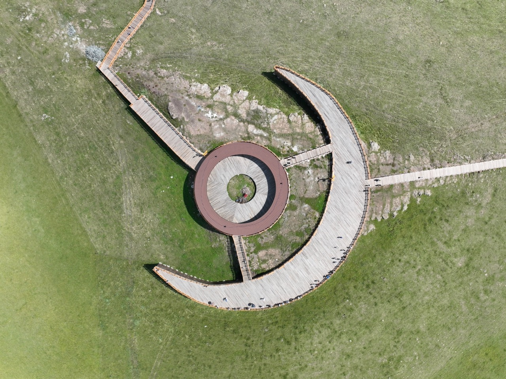
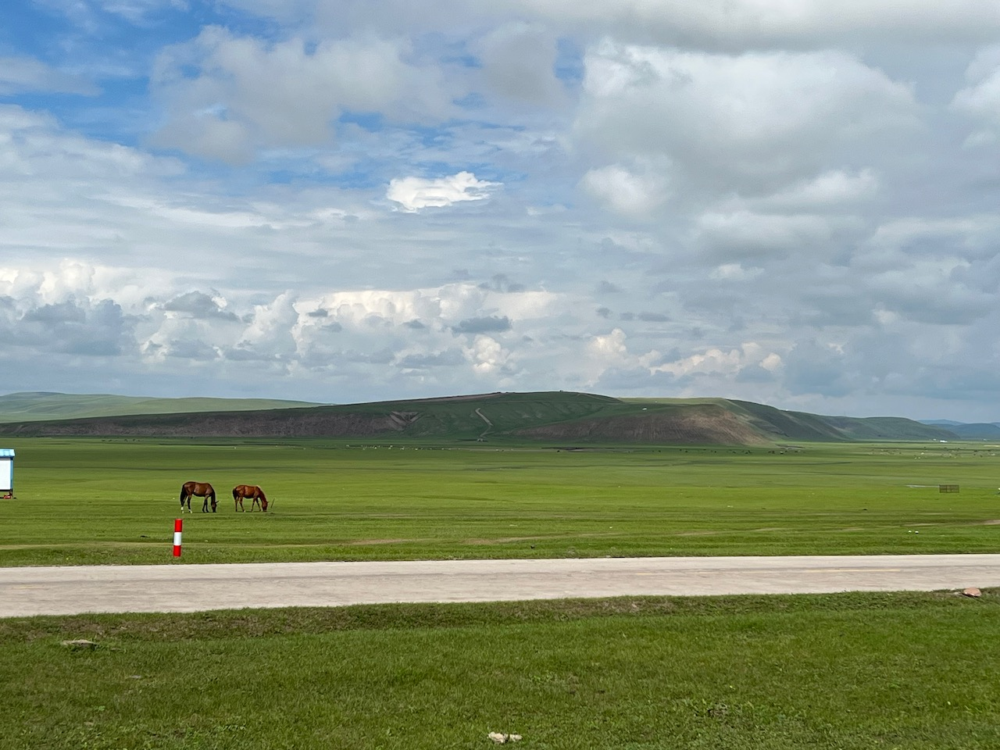

先来看一下大致的路线图， 我们的路线是 海拉尔->额尔古纳->根河（冷极村->室韦->海山头->满洲里

## 布里亚特包子

飞机到达海拉尔的当天，来接我们的导游带我们去吃了这个包子，布里亚特族的包子，牛肉包，特别好吃！

## 莫尔格勒河景区

第二天，我们开车进了莫尔格勒河景区。景区的接驳车设备已经差不多修建完了，大概之后要坐车才能进出了

>> 莫尔格勒河，草原上的河都是这么弯弯曲曲的

>> 无人机

>> 景区里有一个人工的观景平台，能远眺草原，还挺漂亮的

>> 草原

据说对面的山丘就是拍 "寻龙诀" 的地方

>> 在湿地里野餐

## 白桦林禁区

蛮无聊的一个景区的，没到深秋，树都还是绿色的，不漂亮

## 根河

中国冷极村

