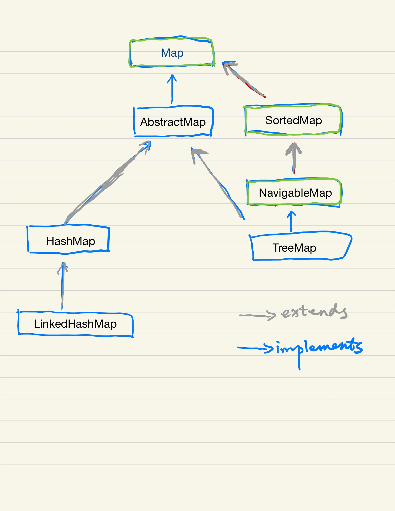

Java 中的 Map 实际上并不属于 Java Collection，因为他并没有继承自 Collection 接口。 在 Java 中，Map 是一个接口

  > An object that maps keys to values.  A map cannot contain duplicate keys;
  > each key can map to at most one value.

AbstractMap 实现 Map 接口，是 Java 中所有 Map 实现的基类。

  > This class provides a skeletal implementation of the {@code Map}
  > interface, to minimize the effort required to implement this interface.

Java 中常用的 Map 有 HashMap， LinkedHashMap， TreeMap， 这个和 Set 类似。




## HashMap

> Hash table based implementation of the {@code Map} interface.  This
> implementation provides all of the optional map operations, and permits
> {@code null} values and the {@code null} key.  (The {@code HashMap}
> class is roughly equivalent to {@code Hashtable}, except that it is
> unsynchronized and permits nulls.)  This class makes no guarantees as to
> the order of the map; in particular, it does not guarantee that the order
> will remain constant over time.

在源码的开头注释就写了 HashMap 和 Hashtable 的区别，

  1. 非线程安全的
  2. key 和 value 都允许是 Null

HashMap 是以 key 的哈希值作为key的值来存储的，他能提供 O(N) 级别的访问效率。 看一下源码，put 的大致思路是：


```java
    public V put(K key, V value) {
        return putVal(hash(key), key, value, false, true);
    }

    static final int hash(Object key) {
        int h;
        return (key == null) ? 0 : (h = key.hashCode()) ^ (h >>> 16);
    }

    /**
     * Implements Map.put and related methods.
     *
     * @param hash hash for key
     * @param key the key
     * @param value the value to put
     * @param onlyIfAbsent if true, don't change existing value
     * @param evict if false, the table is in creation mode.
     * @return previous value, or null if none
     */
    final V putVal(int hash, K key, V value, boolean onlyIfAbsent,
                   boolean evict) {
        Node<K,V>[] tab; Node<K,V> p; int n, i;
        // 如果 table 没有初始化，那就初始化一下
        if ((tab = table) == null || (n = tab.length) == 0)
            n = (tab = resize()).length;
        // 计算index，并对 null 做处理
        if ((p = tab[i = (n - 1) & hash]) == null)
            tab[i] = newNode(hash, key, value, null);
        else {
            Node<K,V> e; K k;
            // 节点存在
            if (p.hash == hash &&
                ((k = p.key) == key || (key != null && key.equals(k))))
                e = p;
            // 节点是树节点
            else if (p instanceof TreeNode)
                e = ((TreeNode<K,V>)p).putTreeVal(this, tab, hash, key, value);
            // 节点是链表
            else {
                for (int binCount = 0; ; ++binCount) {
                    if ((e = p.next) == null) {
                        p.next = newNode(hash, key, value, null);
                        if (binCount >= TREEIFY_THRESHOLD - 1) // -1 for 1st
                            treeifyBin(tab, hash);
                        break;
                    }
                    if (e.hash == hash &&
                        ((k = e.key) == key || (key != null && key.equals(k))))
                        break;
                    p = e;
                }
            }
            if (e != null) { // existing mapping for key
                V oldValue = e.value;
                if (!onlyIfAbsent || oldValue == null)
                    e.value = value;
                afterNodeAccess(e);
                return oldValue;
            }
        }
        ++modCount;
        if (++size > threshold)
            resize();
        afterNodeInsertion(evict);
        return null;
    }
```

这个代码，功能复杂，大致步骤是这样：

1. 检查是否需要初始化和是否需要扩容
2. 计算下标 (n-1) & hash, 如果不存在，则直接赋值
3. 如果存在，获取已存在的值，并且考虑是链表还是树，
4. 如果是链表，检查下是否需要转换成红黑树结构
5. 替换旧的值
6. 检查是否需要扩容

其中还涉及到是否需要把链表结构变成树结构，在元素减少的时候，把树结构变成链表结构。

添加元素的时候，还考虑是否需要扩容，扩容的时候会对重新做 rehash， rehash 就会导致不稳定

## LinkedHashMap

LinkedHashMap 和 HashMap 的区别主要就是 Linked 这个字，他在内部维护一个双向链表的实现。并由这个双向链表来保持遍历顺序的稳定，通常来说这个顺序由插入时顺序决定。

LinkedHashMap 同样也是线程不安全的。

LinkedHashMap 提供一个特殊的构造函数，遍历顺序根据最后访问时间,  accessOrder = true, 默认情况下 accessOrder = false， 遍历时根据插入顺序

```java
    /**
     * Constructs an empty {@code LinkedHashMap} instance with the
     * specified initial capacity, load factor and ordering mode.
     *
     * @param  initialCapacity the initial capacity
     * @param  loadFactor      the load factor
     * @param  accessOrder     the ordering mode - {@code true} for
     *         access-order, {@code false} for insertion-order
     * @throws IllegalArgumentException if the initial capacity is negative
     *         or the load factor is nonpositive
     */
    public LinkedHashMap(int initialCapacity,
                         float loadFactor,
                         boolean accessOrder) {
        super(initialCapacity, loadFactor);
        this.accessOrder = accessOrder;
    }
```

这种方式特别时候构建一个 LRU 缓存数据， 

## TreeMap

TreeMap 实现了 NavigableMap， 而 NavigableMap 继承了 SortedMap。 因此 TreeMap 中的元素都是按照他们的 Comparable 实现或者 Comparator 排序的，存储是有序的。因为实际是以 tree 的形式存储的，因此 add，remove 和 contains 都可以保证 log(n) 的时间复杂度。

> A Red-Black tree based {@link NavigableMap} implementation.
> The map is sorted according to the {@linkplain Comparable natural
> ordering} of its keys, or by a {@link Comparator} provided at map
> creation time, depending on which constructor is used.


## 什么时候用哪个 Map 结构呢？

根据特性来决定使用哪个结构

|    特性     | HashMap     | LinkedHashMap | TreeMap   |
| ---------- | -----------: | -------------:| --------: |
| 遍历 | 无序 | 根据插入顺序或者最后访问时间 | 根据 Comparable 结果 |
| 线程安全 | 否 | 否 | 否 |

所以，总的来说，HashMap 符合通用的场景； 如果你需要一个保持插入时顺序的，或者要构建一个 LRU 缓存，用 LinkedHashMap。 如果你想要一个能排序的，比如根据姓名能依次输出结果的Map，那么就使用 TreeMap


