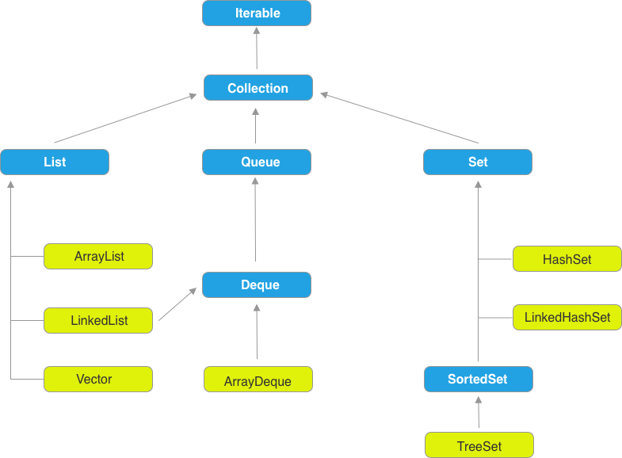

集合是我们平常用的最多的数据类型了，并且自带很多常用方法，比如 sort 等，

# Collection

Collection 接口是 Java 集合体系的根，可以说所有的集合都实现了这个接口。 Collection 扩展/继承了 Iterable 接口， 而 Iterable 就是 Java 中经典的 Iterator 模式。

Collection 下面分为三个大的部分，List， Queue 和 Set。 总体结构图如下所示：




## List

看 JDK 源码， List 开头注释写了：

  An ordered collection, xxxx has precise control over where each element is inserted. xxx, can access by there integer index.

什么意思？ 一个有序的集合，可以精确控制元素插入到集合中的位置，可以通过在元素在集合中的坐标来访问。

### ArrayList

ArrayList， 实际上比较像是一个可以动态扩展的数组。 

### LinkedList

Java 中 LinkedList 是 Double-Linked list， 并且实现了 Deque 接口（发音 deck）。这个 Deque 接口做什么？ Deque 是 “double ended queue” 的缩写， 支持在集合的两端插入和删除。 

LinkedList 既然是一个 Double-Linked List， 那么根据坐标 index 遍历的时候，就会自动选择从哪个端开始， 哪端近就从哪个开始

LinkedList 不是线程安全的。 如果想创建一个线程安全的 LinkedList，可以 Collections 的方法：

```java
  List list = Collections.synchronizedList(new LinkedList(...));
```


### Vector

Vector 是 Java 最早的提供的工具类集合之一。 他也是一个动态数组，可以用下标访问，和 ArrayList 非常像。 但是不同的是 Vector 是线程安全的，而且包含了很多遗留的方法。 （不建议使用）


## Queue

Queue，队列，顾名思义是一个先进先出（FIFO）的集合。 但是 Priority Queue 不是根据 FIFO 来的，而是根据定义的 Order 来存放。 Queue 除了提供继承自 Collection 的 add， remove， element 方法之外， 自身还提供了 offer， poll 和 peek 方法。区别是前者如果操作失败，会抛出异常，后者不会抛出异常，会返回 null 或者 false。


## Set

Set 是一个不能包含有相同元素的集合，跟数学上的 set 概念类似。常用的 Set 有 Hashsets， LinkedHashset 和 TreeSet。


### HashSet

HashSet 实际背后是一个 HashMap， 他包含的所有元素都必须唯一， 可以是 null。 由于背后是一个 HashMap，因此如果你遍历这个 HashSet，他的顺序是不能保证一致的。但是他能保证的常数级别的时间复杂度，比如插入，删除等。

HashSet 不是线程安全的。 因此如果你在遍历这个 HashSet 的时候，这个 set 被修改了，会抛出一个 ConcurrentModificationException 异常。这个属于 fail-fast 策略。

```java
  HashSet<String> hs = new HashSet<>();
  hs.add("Rachit");
  hs.add("Amit");
  hs.add("jack");

  Iterator iterator = hs.iterator();
  while (iterator.hasNext()) {
      System.out.println(iterator.next());
  }

  ### 输出
  Amit
  Rachit
  jack

```

### LinkedHashSet

LinkedHashSet 背后是一个实现了 LinkedList 的 HashTable。 LinkedList 决定了遍历时的顺序，这个顺序是由往集合里插入的顺序决定的。 因此和 HashSet 的主要区别是Linked是有序的。

```java
  LinkedHashSet<String> linkedHashSet = new LinkedHashSet<>();
  linkedHashSet.add("Rachit");
  linkedHashSet.add("Amit");
  linkedHashSet.add("jack");

  Iterator iterator = linkedHashSet.iterator();
  while (iterator.hasNext()) {
      System.out.println(iterator.next());
  }

  ### Console
  Rachit
  Amit
  jack
```


### TreeSet

TreeSet 背后是一个 TreeMap，实现了 NavigableSet 接口，元素都是以 Tree 的形式存储的。 TreeSet 中的元素都是按照他们的 Comparable 实现或者 Comparator 排序的，存储是有序的。因为实际是以 tree 的形式存储的，因此 add，remove 和 contains 都可以保证 log(n) 的时间复杂度。

```java
  TreeSet<String> ts = new TreeSet<>();
  ts.add("Rachit");
  ts.add("Amit");
  ts.add("jack");
  ts.add("Jack");

  Iterator iterator1 = ts.iterator();
  while (iterator1.hasNext()) {
      System.out.println(iterator1.next());
  }

  ## Console
  Amit
  Jack
  Rachit
  jack
```

所以三个 Set 之间，HashSet 是无序的（或者说根据hash的顺序）， LinkedHashSet 是按照插入的顺序，而 TreeSet 是按照 natural order（Comparable）顺讯存储的。

暂时总结到这里