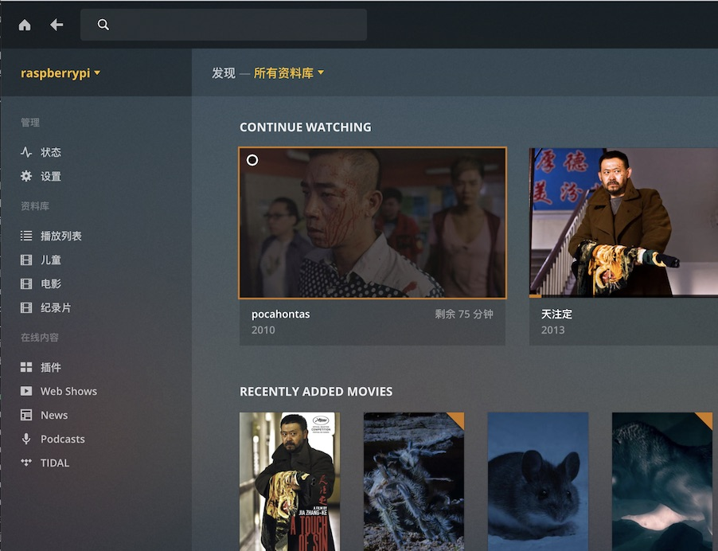
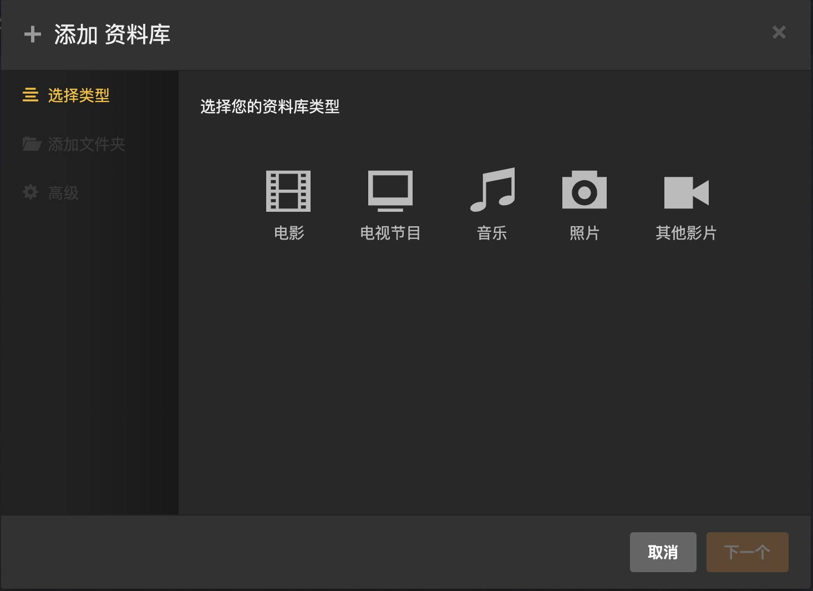
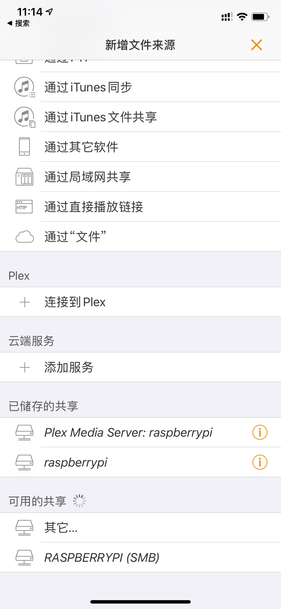

在安装 Plex Server 之前，先把系统升级到最新版。

```bash
sudo apt-get update
sudo apt-get upgrade
```

然后添加 Plex Server 的官方代码库。在这之前还需要安装 apt-transport-https 包，来支持 apt 包管理软件从 https 读取包。

```bash
sudo apt-get install apt-transport-https
```

添加安装源

```bash
curl https://downloads.plex.tv/plex-keys/PlexSign.key | sudo apt-key add -
```

```bash
echo deb https://downloads.plex.tv/repo/deb public main | sudo tee /etc/apt/sources.list.d/plexmediaserver.list
```

```bash
sudo apt-get update
```


```bash
sudo apt-get install plexmediaserver
```

默认情况下， plex media server 是以 plex 这个用户运行的，为了避免由于匿名用户造成的权限问题，把它改成以 pi 的用户身份运行。

找到 /etc/default/plexmediaserver, 把 plex 改成 pi

```bash
export PLEX_MEDIA_SERVER_USER=pi
```

重启生效

```bash
sudo systemctl restart plexmediaserver
```


## 设置固定 IP 地址

作为一个资源库，当然是需要有一个固定 IP 会比较好，免得重启之后引起冲突

```bash
hostname -I

sudo vi /boot/cmdline.txt

ip=YOUR IP
```

把 IP 设置为你的 IP， 然后重启树莓派


## 访问 Web 站点

我的 IP 地址是 192.168.3.52, 所以访问的地址是: http://192.168.3.52:32400/web/index.html,  我已经添加了不少资源



鼠标放到 播放列表 上，会出现添加按钮， 可以把想要添加进来的电影都添加进来




## iPhone/iPad/Apple TV 上使用

在 iPhone， iPad 或者 Apple TV 上使用，需要购买 Infuse Pro 这个软件，我记得是50块钱，但是物超所值。 这是在我的 iPhone 上，只要你在家里，随时随地可以看。


