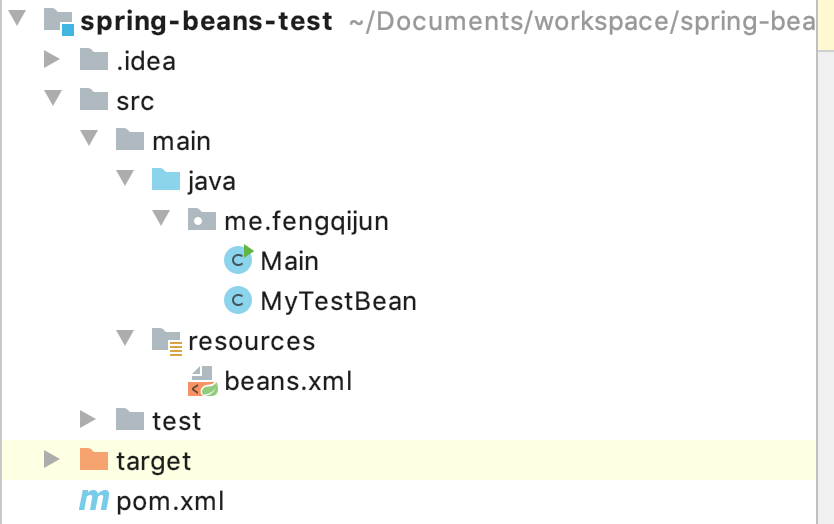
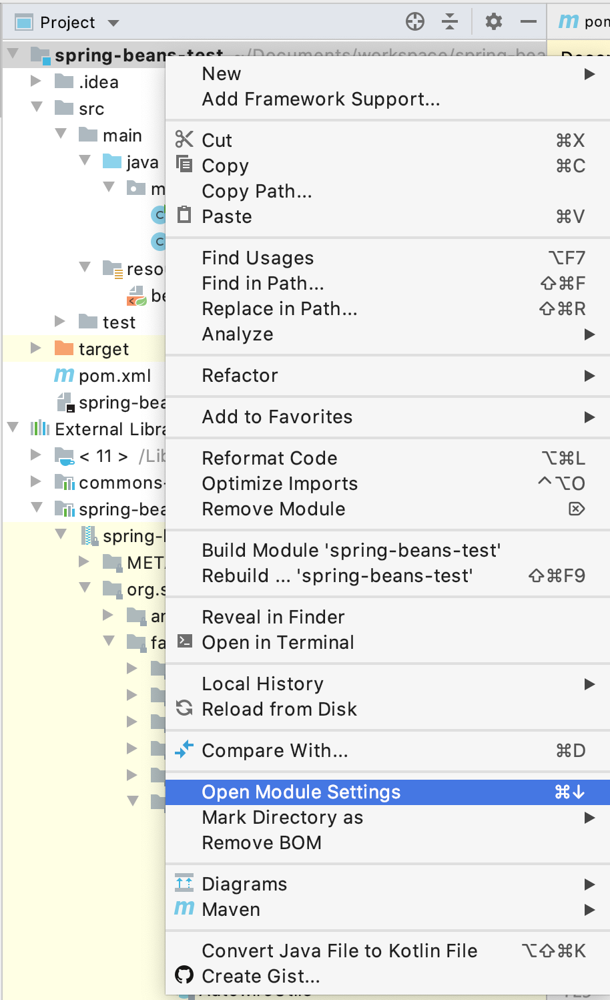
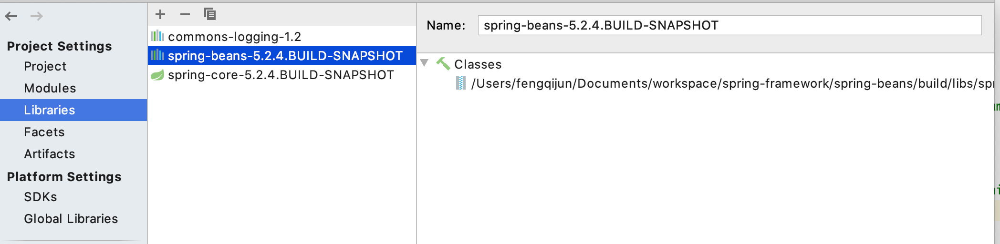
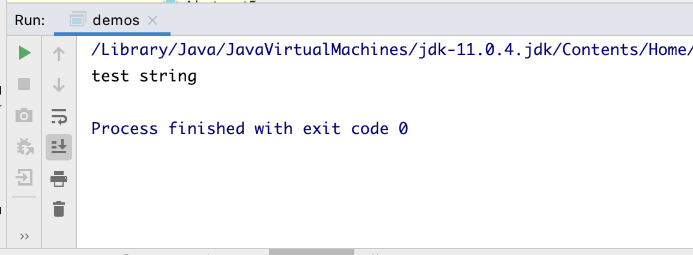
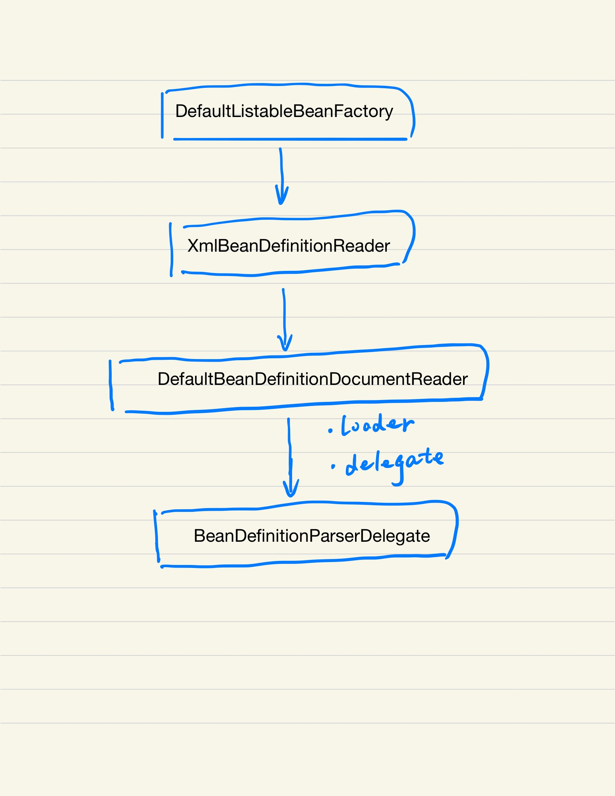

可能你已经习惯了直接从 Spring Initializer 来初始化一个 Spring Boot 项目，然后整个 Spring 框架就被带到项目里面来了。其实 Spring 作为一个十分优秀的框架，每个组建都是可以独立使用的。 探索 Spring Beans 组建，我们就从头开始添加需要的 Jar 包。

## Build From Source

参考 Spring [官方文档](https://github.com/spring-projects/spring-framework/wiki/Build-from-Source), 下载编译源代码

```bash
git clone git@github.com:spring-projects/spring-framework.git
cd spring-framework

./gradlew build

```

如果你第一次编译，下载所有需要的代码和库，可能会需要不少时间。


## 使用 Spring Beans

我们新建一个 Maven 项目来单独使用 Spring Beans。 我使用 Intellij Idea， File -> New -> Project， 选择 Maven 项目模板，创建一个空项目。 新建第一个类: me.fengqijun.Main



添加 Spring Beans 的 Jar 包。 通过 Open Module Setting 来设置项目以来的 Libries



添加之前我们自己编译出来的 Jar 包， Jar 包的路径是在 spring 项目下，对应的 module， build -> libs 下，



看到这里一共添加了 3 个 jar 包，这个 Core 是 Beans 依赖的， 而 apache commons 是 Core 依赖的。

## 使用 Beans

添加 MyTestBean.java 类，

```java

package me.fengqijun;

public class MyTestBean {
    private String testStr = "test string";

    public String getTestStr() {
        return testStr;
    }

    public  void setTestStr(String value) {
        this.testStr = value;
    }
}

```

在 resources 目录下，添加 beans.xml 文件 

```xml
<?xml version="1.0" encoding="UTF-8"?>
<beans xmlns="http://www.springframework.org/schema/beans"
       xmlns:xsi="http://www.w3.org/2001/XMLSchema-instance"
       xsi:schemaLocation="http://www.springframework.org/schema/beans http://www.springframework.org/schema/beans/spring-beans.xsd">
    <bean id="myTestBean" class="me.fengqijun.MyTestBean" />
</beans>
```

修改 Main.java 类

```java
package me.fengqijun;

import org.springframework.beans.factory.support.DefaultListableBeanFactory;
import org.springframework.beans.factory.xml.XmlBeanDefinitionReader;
import org.springframework.core.io.ClassPathResource;

public class Main {
    public static void main(String[] args) {

        DefaultListableBeanFactory factory = new DefaultListableBeanFactory();

        XmlBeanDefinitionReader xmlBeanDefinitionReader = new XmlBeanDefinitionReader(factory);
        xmlBeanDefinitionReader.loadBeanDefinitions(new ClassPathResource("beans.xml"));

        MyTestBean bean = (MyTestBean) factory.getBean("myTestBean");

        System.out.println(bean.getTestStr());
    }
}
```

运行，可以看到 Console 输出：



## 入门 Bean Factory

从示例代码里看到，用 DefaultListableBeanFactory， 这个示 Spring 默认的 BeanFactory，

  Spring's default implementation of the {@link ConfigurableListableBeanFactory}
  and {@link BeanDefinitionRegistry} interfaces: a full-fledged bean factory
  based on bean definition metadata, extensible through post-processors.

而 BeanFactory 需要有一个 BeanDefinitionReader，通过 Reader 来加载 Beans。

```java 

# XmlBeanDefinitionReader.java
public int loadBeanDefinitions(EncodedResource encodedResource) throws BeanDefinitionStoreException {
		Assert.notNull(encodedResource, "EncodedResource must not be null");
		if (logger.isTraceEnabled()) {
			logger.trace("Loading XML bean definitions from " + encodedResource);
		}
    ...

      return doLoadBeanDefinitions(inputSource, encodedResource.getResource());
    ...
}


# doLoadBeanDefinitions 由调用了 registerBeanDefinitions

public int registerBeanDefinitions(Document doc, Resource resource) throws BeanDefinitionStoreException {
	BeanDefinitionDocumentReader documentReader = createBeanDefinitionDocumentReader();
	int countBefore = getRegistry().getBeanDefinitionCount();
	documentReader.registerBeanDefinitions(doc, createReaderContext(resource));
	return getRegistry().getBeanDefinitionCount() - countBefore;
}

```

这里又调用了一个 DefaultBeanDefinitionDocumentReader 的 registerBeanDefinitions， 这个是默认的 Reader，

```java
	/**
	 * Register each bean definition within the given root {@code <beans/>} element.
	 */
	@SuppressWarnings("deprecation")  // for Environment.acceptsProfiles(String...)
	protected void doRegisterBeanDefinitions(Element root) {
		// Any nested <beans> elements will cause recursion in this method. In
		// order to propagate and preserve <beans> default-* attributes correctly,
		// keep track of the current (parent) delegate, which may be null. Create
		// the new (child) delegate with a reference to the parent for fallback purposes,
		// then ultimately reset this.delegate back to its original (parent) reference.
		// this behavior emulates a stack of delegates without actually necessitating one.
		BeanDefinitionParserDelegate parent = this.delegate;
		this.delegate = createDelegate(getReaderContext(), root, parent);

		if (this.delegate.isDefaultNamespace(root)) {
			String profileSpec = root.getAttribute(PROFILE_ATTRIBUTE);
			if (StringUtils.hasText(profileSpec)) {
				String[] specifiedProfiles = StringUtils.tokenizeToStringArray(
						profileSpec, BeanDefinitionParserDelegate.MULTI_VALUE_ATTRIBUTE_DELIMITERS);
				// We cannot use Profiles.of(...) since profile expressions are not supported
				// in XML config. See SPR-12458 for details.
				if (!getReaderContext().getEnvironment().acceptsProfiles(specifiedProfiles)) {
					if (logger.isDebugEnabled()) {
						logger.debug("Skipped XML bean definition file due to specified profiles [" + profileSpec +
								"] not matching: " + getReaderContext().getResource());
					}
					return;
				}
			}
		}

		preProcessXml(root);
		parseBeanDefinitions(root, this.delegate);
		postProcessXml(root);

		this.delegate = parent;
	}
```

大体上的调用关系如这个图，



今天代码读不动了，下次继续。。。
